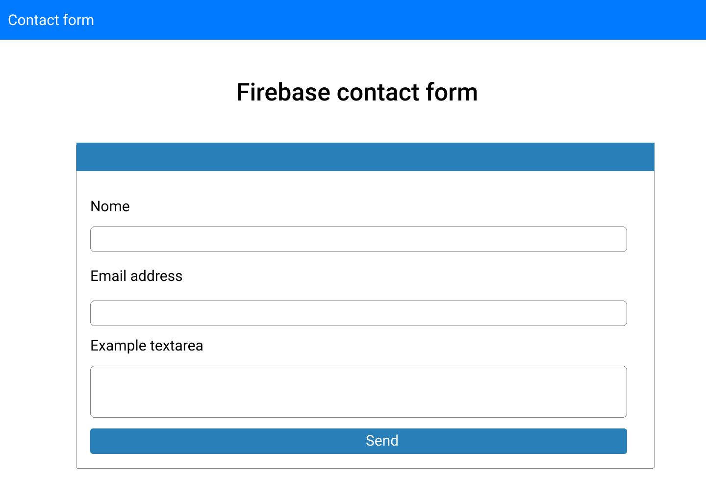
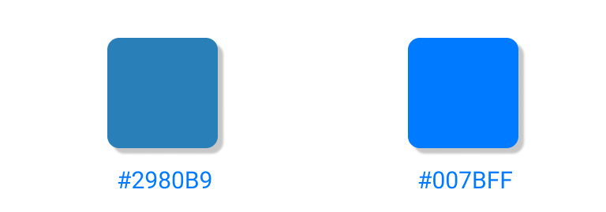

# Formulário de contato usando firebase

    

## Paleta de cores

    

## Tecnologias 

 Tecnologias | Version |
 ------ |------|
  Firebase | 7.2.3 |
  Bootstrap | 4.5.0 |

## Rodando o projeto

- Para rodar o projeto basta abrir o arquivo index.html em algum navegador

## Como funciona

> Vinculei o firebase a uma conta minha
> ele enviará os dados inseridos para o cloud
> do firebase, aonde terei visibilidade das informações.

Autora
----

Desenvolvido por [Yasmim Barbosa Vieira](https://www.linkedin.com/in/yasmim-barbosa/) - Desenvolvedora Front-end